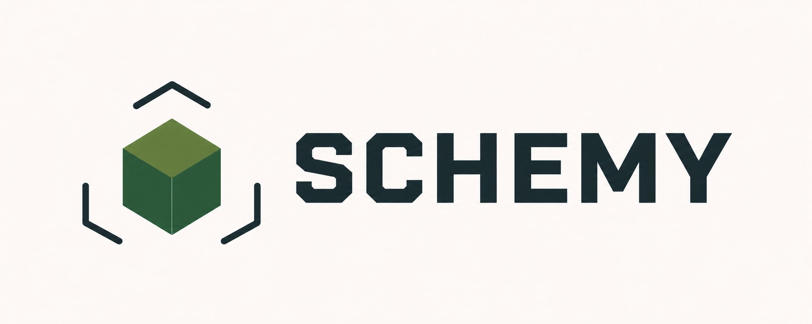

<p align="center">
  
</p>

# Schemy

[](https://github.com/Sablednah/Schemy/actions/workflows/build.yml)

A small, fast desktop app for previewing Minecraft structure files in 3D on Windows, macOS, and Linux.

Open a structure from the File menu, drag it into the window, or associate a supported file type with Schemy and open it directly from your file manager.

## Features

- Interactive orbit, pan, and zoom controls
- Native Windows, macOS, and Linux packages
- Double-click file associations
- Windows Explorer thumbnails and Preview pane integration
- File picker and drag-and-drop opening
- Efficient instanced rendering for large structures
- Procedural geometry for common non-cube Minecraft blocks
- Original colour preview plus optional generated pixel textures
- Gzip-compressed and uncompressed NBT support
- Model format, dimensions, and non-air block count
- Automatic format detection from NBT contents

## Supported formats

| Extension | Format | Support |
| --- | --- | --- |
| `.schematic` | Classic MCEdit/Schematica | Legacy block IDs, metadata variants, and `AddBlocks` extended IDs |
| `.schem` | Sponge/WorldEdit v1–v3 | Modern palettes, block states, and varint block data |
| `.nbt` | Vanilla Java structure block | Palettes, properties, and sparse block positions |
| `.litematic` | Litematica | Packed 64-bit block states and multiple positioned regions |

Block and entity NBT is read safely but is not visually rendered yet. Schemy includes procedural models for slabs, stairs (including inner and outer corners), fences, walls, panes, bars, doors, trapdoors, rails, carpets, snow layers, ladders, plants, wall and standing torches, signs, banners, chests, beds, cauldrons, lanterns, buttons, pressure plates, flower pots, hoppers, anvils, bells, chains, rods, brewing stands, lecterns, grindstones, stonecutters, campfires, heads, candles, eggs, crystals, scaffolding, vines, portals, redstone wire, repeaters, farmland, and cacti. Technical blocks such as barriers and light blocks remain invisible. Highly specialised or resource-pack-defined models still use a cube or a simplified approximation.

## Controls

| Action | Control |
| --- | --- |
| Rotate | Left mouse drag |
| Pan | Right mouse drag |
| Zoom | Mouse wheel |
| Open file | `Ctrl+O` / `Cmd+O` |
| Change appearance | **View → Generated textures**, `Ctrl+T` / `Cmd+T`, or the **Textures: On/Off** button |

The texture mode is generated locally and does not redistribute Mojang texture assets. The original colour rendering remains the default.

## Development

Install [Node.js 22 or newer](https://nodejs.org/) and enable pnpm:

```powershell
corepack enable
corepack prepare pnpm@11.9.0 --activate
```

Install dependencies and start the development app:

```powershell
pnpm install
pnpm dev
```

Run the parser tests:

```powershell
pnpm test
```

## Building locally

```powershell
pnpm build
```

Installers are written to `release/`. Build on the operating system you want to target.

## Automated builds

The [GitHub Actions workflow](https://github.com/Sablednah/Schemy/actions/workflows/build.yml) tests the parsers and builds on real hosted Windows, macOS, and Linux runners. Open a successful run and download the package for your platform from its **Artifacts** section.

The macOS artifact is currently unsigned. macOS users must explicitly allow it through Gatekeeper. Public distribution without that warning requires Apple Developer signing and notarization.

## Roadmap

- More specialised and resource-pack-defined block geometry
- Optional user-supplied Minecraft resource packs
- Block entity and entity previews
- Render-to-image export

## Windows Explorer previews

The Windows installer includes a native Explorer extension for all supported formats. It generates model thumbnails for icon views and a larger static render in Explorer's Preview pane. A **Loading...** state appears while the first render is prepared.

Windows keeps the Preview Handler in its recommended low-integrity process. A small per-user Schemy broker performs the 3D render at normal user integrity and returns only the resulting PNG through a local pipe restricted to the current user and Windows' `prevhost.exe`. The broker starts automatically at sign-in; no administrator access or `DisableLowILProcessIsolation` registry override is required.

The first preview normally takes a few seconds because the renderer starts on demand. Explorer thumbnails and Preview pane renders use the same model parsing and geometry as the main app.

For development diagnostics, run `tools/diagnose-windows-preview.ps1` with `-EnableTrace`, then restart Explorer. This opt-in setting writes `SchemyPreview.log` and `SchemyPreviewBroker.log` beneath the current user's temporary directory. Remove `HKCU\Software\Schemy\PreviewTrace` to turn tracing off again.

This component is installed only on Windows. The macOS and Linux packages are unchanged and continue to provide file association and direct opening through their native file managers.
